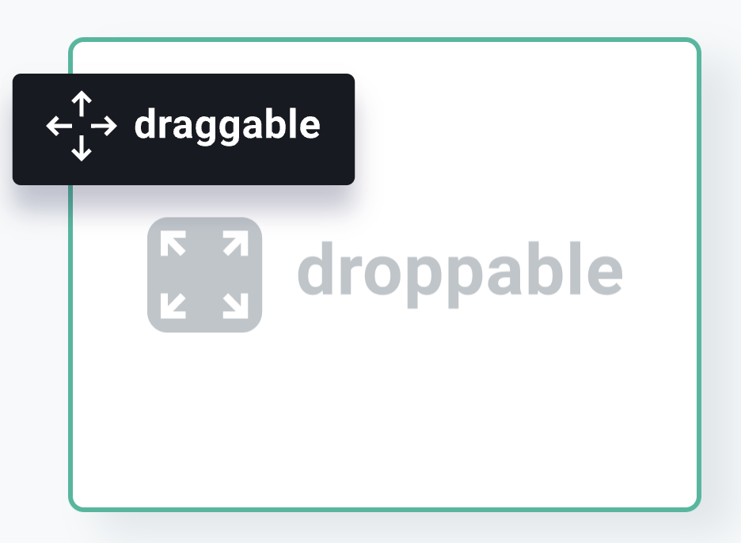

# awesome-web-ui-components
collection of ui components

### Component Library

| Repository |  Demo |
| ---- |  ---- |
| [mui](https://mui.com/)  |  |
| [antd](https://ant.design/)  |  |

### ui components

| Repository | description | Demo |
| ---- |  ---- |  ---- |
| [dnd kit](https://dndkit.com/)   [dnd kit examples](https://master--5fc05e08a4a65d0021ae0bf2.chromatic.com/?path=/story/core-draggable-hooks-usedraggable--basic-setup)  | A lightweight, performant, accessible and extensible drag & drop toolkit for React.  |  |
| [ScrollReveal](https://scrollrevealjs.org) | ScrollReveal is a JavaScript library for easily animating elements as they enter/leave the viewport. It was designed to be robust and flexible, but hopefully you’ll be surprised below at how easy it is to pick up. | |